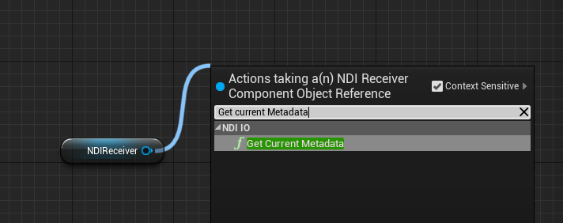
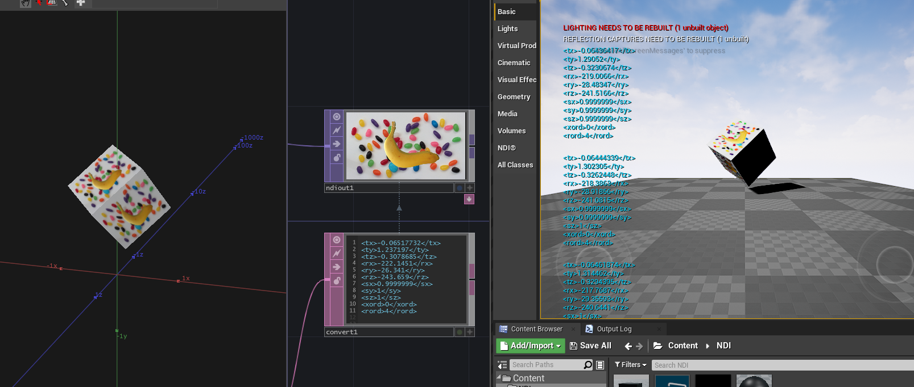

# UE-Plugin-NDImodify

### 1. Get Metadata

Source : https://forums.unrealengine.com/t/accessing-audio-track-or-metadata-via-c-from-an-ndi-stream-loaded-via-the-ndi-plugin/116955/2

---
### Example

- Plugins used in the example files : [EasyXMLParser
](https://unrealengine.com/marketplace/en-US/product/easyxmlparser) - https://github.com/ayumax/EasyXMLParser